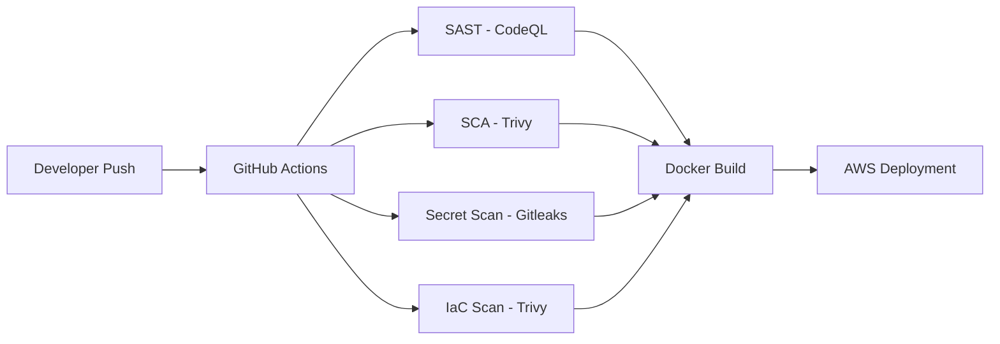

# 🔐 DevSecOps Pipeline — NexusCore Technologies


> A production-ready DevSecOps pipeline with automated security scanning at every stage of the development lifecycle — built for a Series A fintech startup processing $2M in daily transactions.

---

## 📋 Table of Contents
- [Business Context](#business-context)
- [Security Tools](#security-tools)
- [Architecture](#architecture)
- [Security Findings](#security-findings)
- [Quick Start](#quick-start)
- [Skills Demonstrated](#skills-demonstrated)

---

## 💼 Business Context

- **Client**: NexusCore Technologies (Fintech — Payment Processing)
- **Challenge**: 3 security incidents in Q4, investors demanding improved security posture
- **Solution**: Shift-left security approach with automated scanning embedded in CI/CD

---

## 🛠️ Security Tools

| Tool | Purpose | Stage |
|---|---|---|
| **CodeQL** | Static Application Security Testing (SAST) | Build |
| **Trivy** | Dependency & Container Scanning (SCA) | Build |
| **Gitleaks** | Secret Detection | Pre-commit |
| **Trivy IaC** | Infrastructure as Code Security | Build |

---

## 🏗️ Architecture



---

## 🔍 Security Findings

> ⚠️ Vulnerabilities are intentional — included for educational purposes only. Never deploy this code to production.

### SAST (CodeQL)
- SQL Injection in user lookup function
- Command Injection in ping endpoint
- Server-Side Template Injection (SSTI)

### SCA (Trivy)
- CVE-2020-14343 in PyYAML 5.4.1 — Critical
- Multiple vulnerabilities in Flask 2.0.1

### IaC (Trivy)
- S3 bucket without encryption
- Security group with overly permissive rules

---

## ⚡ Quick Start

```bash
# Clone the repository
git clone https://github.com/AurelienKumarathas/devsecops-pipeline-project-1.git
cd devsecops-pipeline-project-1

# Push to trigger the pipeline
git push

# View scan results in the Actions tab on GitHub
```

---

## 💼 Skills Demonstrated

| Skill | Tool | Relevance |
|---|---|---|
| CI/CD Pipeline Design | GitHub Actions | Automated security gates |
| SAST | CodeQL | Static code vulnerability detection |
| SCA | Trivy | Dependency & container scanning |
| Secret Detection | Gitleaks | Pre-commit secret prevention |
| IaC Security | Trivy IaC | Terraform misconfiguration scanning |
| Container Security | Docker | Secure image best practices |
| Cloud Deployment | AWS | Production-ready infrastructure |

---

## 📄 License

MIT — see [LICENSE](LICENSE) for details.

---


