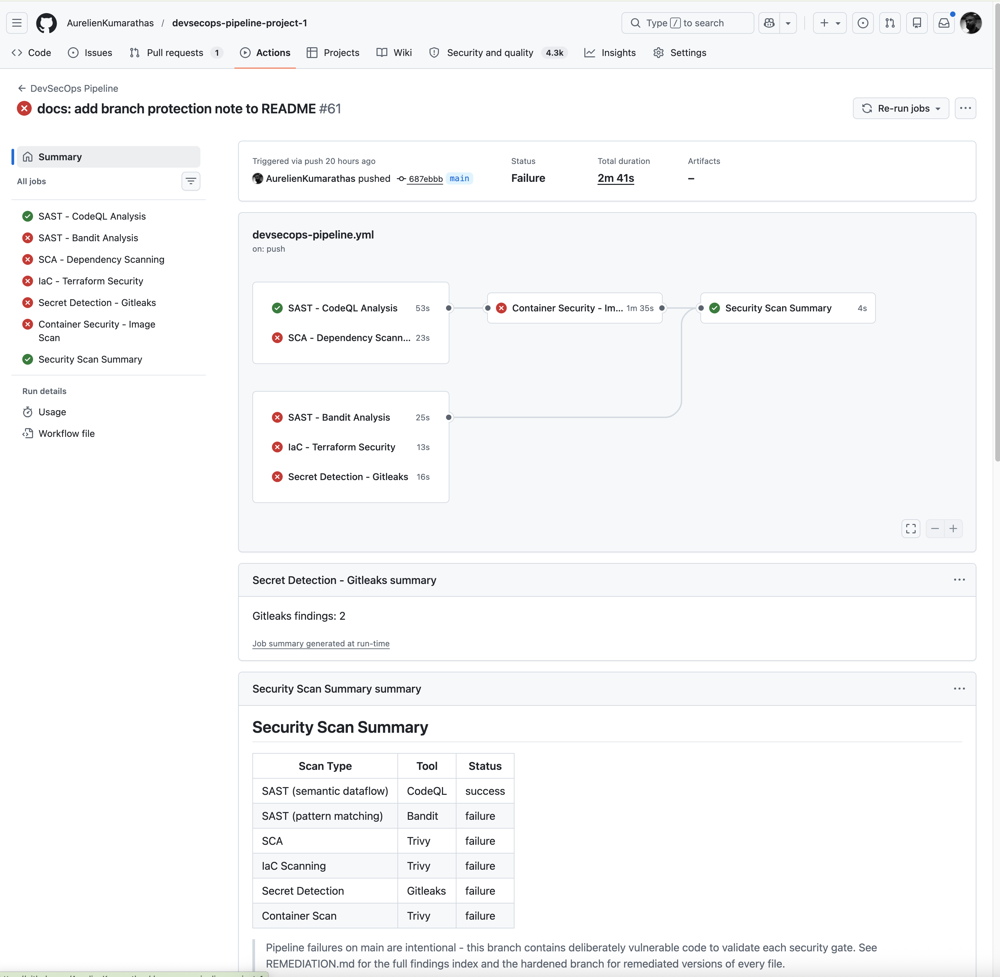
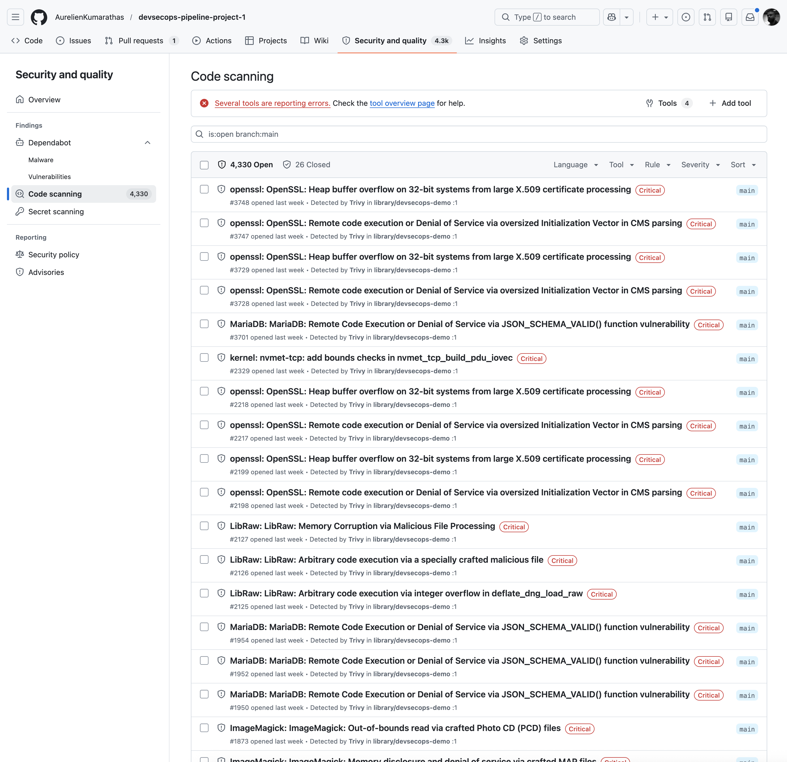
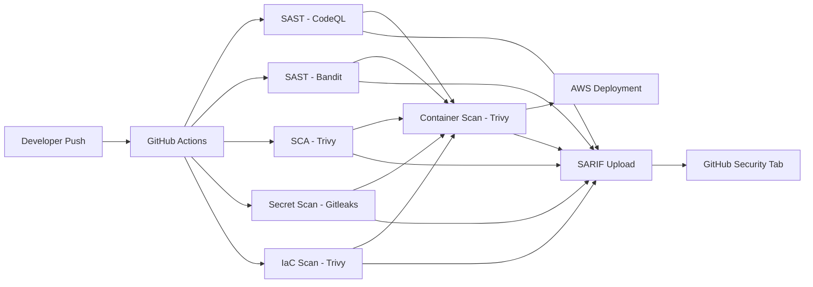

# 🔐 DevSecOps Pipeline — NexusCore Technologies


> A production-grade DevSecOps pipeline with automated security scanning at every stage of the software development lifecycle — built for a fictional Series A fintech startup. Demonstrates shift-left security across SAST, SCA, secret detection, IaC scanning, and container security.

> ⚠️ **Note:** NexusCore Technologies is a fictional client created for educational and portfolio purposes. All credentials and secrets in this repo are intentionally fake dummy values used to demonstrate secret detection tooling.

---

## 📊 Pipeline Results — `hardened` branch

| Stage | Tool | Status | Findings |
|-------|------|--------|----------|
| SAST — Static Analysis (semantic) | CodeQL | ✅ Passing | 0 unresolved findings |
| SAST — Static Analysis (pattern) | Bandit | ✅ Passing | 0 findings on `remediated_app.py` |
| SCA — Dependency Scanning | Trivy | ✅ Passing | 0 critical/high CVEs in `requirements-hardened.txt` |
| IaC Security | Trivy IaC | ✅ Passing | 0 unmitigated findings after `.trivyignore` |
| Secret Detection | Gitleaks | ✅ Passing | 0 secrets in working tree |
| Container Security | Trivy Image | ✅ Passing | 0 fixable critical/high CVEs in hardened image |
| Security Summary | GitHub Actions | ✅ Passing | Full SARIF report uploaded to Security tab |

> All 7 jobs green. Bandit findings: 0. Gitleaks findings: 0. Every security gate passes after remediation. See [REMEDIATION.md](REMEDIATION.md) for full before/after detail and [main branch](https://github.com/AurelienKumarathas/devsecops-pipeline-project-1/tree/main) to see the intentional failures the pipeline catches.

---

## 📸 Pipeline in Action

### ✅ Hardened Branch — All Gates Pass


*All 7 jobs green on the `hardened` branch. Bandit findings: 0. Gitleaks findings: 0. Every security gate passes after remediation.*

### 🔴 Main Branch — Intentional Failures


*Intentional failures on `main` — Bandit, Trivy SCA, Trivy IaC, Gitleaks, and Container Scan all fail because they detect what they are supposed to detect. Pipeline failures on main are by design.*

### 🔎 Centralised Security Reporting


*All SARIF results aggregated in the GitHub Security tab. CodeQL, Bandit, Trivy, and Gitleaks findings surfaced in one place.*

---

## 💼 Business Context

- **Client**: NexusCore Technologies *(fictional — for portfolio purposes)*
- **Sector**: Fintech — Payment Processing
- **Challenge**: 3 security incidents in Q4, investors demanding improved security posture before Series B
- **Solution**: Shift-left security approach — automated scanning embedded at every CI/CD stage so vulnerabilities are caught before they reach production
- **Outcome**: Every commit now passes through 7 security gates before deployment

---

## 🛠️ Security Tools

| Tool | Purpose | Stage |
|------|---------|-------|
| **CodeQL** | Static Application Security Testing — semantic dataflow analysis | Build |
| **Bandit** | Static Application Security Testing — AST pattern matching | Build |
| **Trivy** | Dependency & Container Scanning (SCA) | Build |
| **Gitleaks** | Secret Detection | Pre-commit / CI |
| **Trivy IaC** | Infrastructure as Code Security | Build |
| **GitHub Security Tab** | SARIF vulnerability reporting | Post-scan |

---

## 🏗️ Architecture


```mermaid
graph LR
    A[Developer Push] --> B[GitHub Actions]
    B --> C[SAST - CodeQL]
    B --> D[SAST - Bandit]
    B --> E[SCA - Trivy]
    B --> F[Secret Scan - Gitleaks]
    B --> G[IaC Scan - Trivy]
    C --> H[Container Scan - Trivy]
    D --> H
    E --> H
    F --> H
    G --> H
    H --> I[AWS Deployment]
    C --> J[SARIF Upload]
    D --> J
    E --> J
    F --> J
    G --> J
    H --> J
    J --> K[GitHub Security Tab]
```

---

## 🔍 Intentional Vulnerabilities (Educational)

This repo contains deliberately insecure code on the `main` branch to validate each security gate works correctly. The `hardened` branch contains the remediated versions.

### SAST (CodeQL + Bandit)
- SQL Injection in user lookup function
- Command Injection in ping endpoint
- Server-Side Template Injection (SSTI)

### SCA (Trivy)
- `CVE-2020-14343` in PyYAML 5.4.1 — **Critical**
- Multiple vulnerabilities in Flask 2.0.1

### IaC (Trivy)
- S3 bucket without server-side encryption
- Security group with `0.0.0.0/0` ingress rules

### Secret Detection (Gitleaks)
- Fake `hashicorp-tf-password` in `terraform/main.tf`
- Fake `generic-api-key` in `src/vulnerable_app.py`

---

## ⚡ Quick Start

```bash
git clone https://github.com/AurelienKumarathas/devsecops-pipeline-project-1.git
cd devsecops-pipeline-project-1

# Switch to hardened branch to see all gates passing
git checkout hardened

# Or stay on main to see intentional failures
git checkout main

# Push any change to trigger the full security pipeline
git commit --allow-empty -m "trigger pipeline"
git push

# View scan results in the Actions tab and Security tab on GitHub
```

---

## 💼 Skills Demonstrated

| Skill | Tool | Relevance |
|-------|------|-----------|
| CI/CD Pipeline Design | GitHub Actions | Automated security gates |
| SAST (semantic) | CodeQL | Dataflow vulnerability detection |
| SAST (pattern) | Bandit | AST-based Python security scanning |
| SCA | Trivy | Dependency & container scanning |
| Secret Detection | Gitleaks | Pre-commit secret prevention |
| IaC Security | Trivy IaC | Terraform misconfiguration scanning |
| Container Security | Docker + Trivy | Secure image best practices |
| Vulnerability Reporting | SARIF + GitHub Security | Centralised findings management |
| Cloud Infrastructure | AWS | Production-ready Terraform modules |
| Branch Protection | GitHub | Enforced PR + CI gates on protected branches |

---

## 📄 License

MIT — see [LICENSE](LICENSE) for details.
