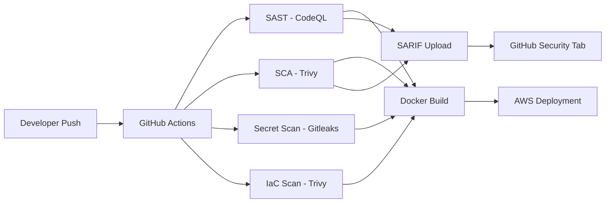

# 🔐 DevSecOps Pipeline — NexusCore Technologies


> A production-grade DevSecOps pipeline with automated security scanning at every stage of the software development lifecycle — built for a fictional Series A fintech startup. Demonstrates shift-left security across SAST, SCA, secret detection, IaC scanning, and container security.

> ⚠️ **Note:** NexusCore Technologies is a fictional client created for educational and portfolio purposes. All credentials and secrets in this repo are intentionally fake dummy values used to demonstrate secret detection tooling.

---

## 📊 Pipeline Results

| Stage | Tool | Status | Findings |
|-------|------|--------|----------|
| SAST — Static Analysis | CodeQL | ✅ Passing | SQL Injection, Command Injection, SSTI detected & reported |
| SCA — Dependency Scanning | Trivy | 🔴 Intentionally fails | CVE-2020-14343 (Critical) in PyYAML 5.4.1; vulns in Flask 2.0.1 |
| IaC Security | Trivy IaC | 🔴 Intentionally fails | S3 bucket unencrypted; overly permissive security group |
| Secret Detection | Gitleaks | 🔴 Intentionally fails | `hashicorp-tf-password` + `generic-api-key` detected in source |
| Container Security | Trivy Image | ⏭️ Skipped | Runs only when Docker image builds successfully |
| Security Summary | GitHub Actions | ✅ Passing | Full SARIF report uploaded to GitHub Security tab |

> Pipeline failures are **by design** — the repo contains intentionally vulnerable code to demonstrate that each security gate correctly detects and blocks real-world vulnerability classes.

---

## 📸 Pipeline in Action


*Live GitHub Actions run showing CodeQL passing, Gitleaks catching hardcoded secrets with commit SHA, file path and line number, and full SARIF upload to the Security tab.*

---

## 💼 Business Context

- **Client**: NexusCore Technologies *(fictional — for portfolio purposes)*
- **Sector**: Fintech — Payment Processing
- **Challenge**: 3 security incidents in Q4, investors demanding improved security posture before Series B
- **Solution**: Shift-left security approach — automated scanning embedded at every CI/CD stage so vulnerabilities are caught before they reach production
- **Outcome**: Every commit now passes through 5 security gates before deployment

---

## 🛠️ Security Tools

| Tool | Purpose | Stage |
|------|---------|-------|
| **CodeQL** | Static Application Security Testing (SAST) | Build |
| **Trivy** | Dependency & Container Scanning (SCA) | Build |
| **Gitleaks** | Secret Detection | Pre-commit / CI |
| **Trivy IaC** | Infrastructure as Code Security | Build |
| **GitHub Security Tab** | SARIF vulnerability reporting | Post-scan |

---

## 🏗️ Architecture


```mermaid
graph LR
    A[Developer Push] --> B[GitHub Actions]
    B --> C[SAST - CodeQL]
    B --> D[SCA - Trivy]
    B --> E[Secret Scan - Gitleaks]
    B --> F[IaC Scan - Trivy]
    C --> G[Docker Build]
    D --> G
    E --> G
    F --> G
    G --> H[AWS Deployment]
    C --> I[SARIF Upload]
    D --> I
    I --> J[GitHub Security Tab]
```

---

## 🔍 Intentional Vulnerabilities (Educational)

This repo contains deliberately insecure code to validate each security gate works correctly:

### SAST (CodeQL)
- SQL Injection in user lookup function
- Command Injection in ping endpoint  
- Server-Side Template Injection (SSTI)

### SCA (Trivy)
- `CVE-2020-14343` in PyYAML 5.4.1 — **Critical**
- Multiple vulnerabilities in Flask 2.0.1

### IaC (Trivy)
- S3 bucket without server-side encryption
- Security group with `0.0.0.0/0` ingress rules

### Secret Detection (Gitleaks)
- Fake `hashicorp-tf-password` in `terraform/main.tf`
- Fake `generic-api-key` in `src/vulnerable_app.py`

---

## ⚡ Quick Start

```bash
git clone https://github.com/AurelienKumarathas/devsecops-pipeline-project-1.git
cd devsecops-pipeline-project-1

# Push any change to trigger the full security pipeline
git commit --allow-empty -m "trigger pipeline"
git push

# View scan results in the Actions tab and Security tab on GitHub
```

---

## 💼 Skills Demonstrated

| Skill | Tool | Relevance |
|-------|------|-----------|
| CI/CD Pipeline Design | GitHub Actions | Automated security gates |
| SAST | CodeQL | Static code vulnerability detection |
| SCA | Trivy | Dependency & container scanning |
| Secret Detection | Gitleaks | Pre-commit secret prevention |
| IaC Security | Trivy IaC | Terraform misconfiguration scanning |
| Container Security | Docker + Trivy | Secure image best practices |
| Vulnerability Reporting | SARIF + GitHub Security | Centralised findings management |
| Cloud Infrastructure | AWS | Production-ready Terraform modules |

---

## 📄 License

MIT — see [LICENSE](LICENSE) for details.
