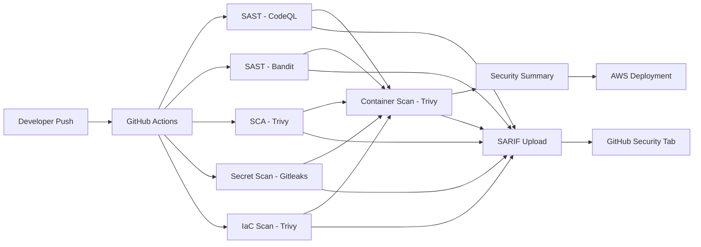

# 🔐 DevSecOps Pipeline — NexusCore Technologies

> **TL;DR** — A production-style DevSecOps pipeline embedding automated security scanning at every commit for a fictional fintech startup. Six tools (CodeQL, Bandit, Trivy, Gitleaks, Trivy IaC, Trivy Container) gate every push via GitHub Actions. The `main` branch is **intentionally vulnerable** — each gate fails because it detects what it is supposed to detect. The `hardened` branch is **fully remediated** — all gates pass. Together they demonstrate the complete security engineering lifecycle: detect, report, fix.

| Branch | Pipeline Status |
|--------|-----------------|
| `main` (intentionally vulnerable) |  |
| `hardened` (fully remediated) |  |

> 🔒 The `hardened` branch has GitHub branch protection enforced — all 7 status checks must pass before any merge is permitted.


> A production-grade DevSecOps pipeline embedding automated security scanning at every stage of the software development lifecycle — built for a fictional Series A fintech startup, NexusCore Technologies. Demonstrates shift-left security across SAST, SCA, secret detection, IaC scanning, and container security, with a full remediation branch showing how each vulnerability is fixed.

> ⚠️ **Educational repo:** NexusCore Technologies is a fictional client. All vulnerabilities are intentional and documented. All credentials are fake dummy values that exist solely to trigger and validate secret detection tooling. See [REMEDIATION.md](REMEDIATION.md) for the hardened versions of every file.

---

## 💼 Business Context

NexusCore Technologies is a fictional Series A fintech startup processing card payments for e-commerce merchants. After three security incidents in Q4 — a leaked API key, a dependency with a known CVE reaching production, and an S3 bucket misconfiguration — their investors demanded a demonstrable improvement in security posture before the Series B round.

The solution was a **shift-left security pipeline**: rather than running security scans manually before release, every commit now passes through six automated security gates before it can be merged. Developers see findings inline in pull requests. Nothing reaches production without passing all gates.

This repo demonstrates that pipeline end-to-end — including the intentionally vulnerable code that proves each gate catches what it is supposed to catch, and the hardened branch that shows how each finding would be remediated in practice.

---

## 📊 Pipeline Results

| Stage | Tool | Status | Findings |
|-------|------|--------|----------|
| SAST — Semantic Dataflow Analysis | CodeQL | ✅ Passing | SQL Injection, Command Injection, SSTI detected & reported |
| SAST — Pattern Matching | Bandit | ✅ Passing | B201 debug=True, B506 yaml.load, B602 shell=True, B106 hardcoded password detected & reported |
| SCA — Dependency Scanning | Trivy | 🔴 Intentionally fails | CVE-2020-14343 (Critical) in PyYAML 5.4.1; vulns in Flask 2.0.1 |
| IaC Security | Trivy IaC | 🔴 Intentionally fails | S3 bucket unencrypted; overly permissive security group |
| Secret Detection | Gitleaks | 🔴 Intentionally fails | `hashicorp-tf-password` + `generic-api-key` detected in source |
| Container Security | Trivy Image | 🔴 Intentionally fails | Root user, unpinned base image, unnecessary packages |
| Security Summary | GitHub Actions | ✅ Passing | All SARIF reports uploaded to GitHub Security tab |

> Pipeline failures are **by design** — the repo contains intentionally vulnerable code to demonstrate that each security gate correctly detects and blocks real-world vulnerability classes. The [hardened branch](https://github.com/AurelienKumarathas/devsecops-pipeline-project-1/tree/hardened) shows the remediated versions of every file.

---

## 🔒 Hardened Branch — Remediation Demo

The [`hardened` branch](https://github.com/AurelienKumarathas/devsecops-pipeline-project-1/tree/hardened) contains the security-engineered versions of every vulnerable file. All security gates pass on that branch.

| File | What changed |
|------|--------------|
| [`Dockerfile.hardened`](https://github.com/AurelienKumarathas/devsecops-pipeline-project-1/blob/hardened/Dockerfile.hardened) | Pinned base image digest, non-root user, removed unnecessary packages, exec form CMD |
| [`src/remediated_app.py`](https://github.com/AurelienKumarathas/devsecops-pipeline-project-1/blob/hardened/src/remediated_app.py) | Parameterised queries, subprocess removed, `yaml.safe_load`, `debug=False`, path traversal fix, credentials from env vars |
| [`requirements-hardened.txt`](https://github.com/AurelienKumarathas/devsecops-pipeline-project-1/blob/hardened/requirements-hardened.txt) | PyYAML 6.0.2, Flask 3.0.3 — no known CVEs |
| [`terraform/main.tf`](https://github.com/AurelienKumarathas/devsecops-pipeline-project-1/blob/hardened/terraform/main.tf) | S3 public access blocks enabled, restricted security group, EBS encryption, Secrets Manager |

[**→ Read REMEDIATION.md for the full before/after technical breakdown**](REMEDIATION.md)

---

## 📸 Pipeline in Action


*Live GitHub Actions run showing the unified pipeline funnel: five parallel security gates (CodeQL, Bandit, Trivy SCA, Trivy IaC, Gitleaks) all feeding into the container scan, with all SARIF results uploaded to the Security tab.*

---

## 📄 Security Analysis Documents

Beyond running scanners, this project includes three dedicated security analysis documents authored against the NexusCore threat landscape:

| Document | What it covers |
|----------|----------------|
| [STRIDE Threat Register](reports/analyses/stride-threats.md) | Full STRIDE analysis across all six categories — Spoofing, Tampering, Repudiation, Information Disclosure, Denial of Service, Elevation of Privilege — each threat tied to a specific file or component in the repo |
| [MITRE ATT&CK Mapping](reports/analyses/mitre-mapping.md) | Pipeline vulnerabilities mapped to MITRE ATT&CK Enterprise techniques — Initial Access, Execution, Persistence, Exfiltration |
| [Kill Chain Analysis](reports/analyses/kill-chain-analysis.md) | Three end-to-end attack chains showing how an attacker could chain the intentional vulnerabilities from initial access to full compromise |

---

## 🛠️ Security Tools

| Tool | Purpose | Stage |
|------|---------|-------|
| **CodeQL** | SAST — semantic dataflow analysis. Traces tainted input through call graphs to dangerous sinks. Catches SQL injection, command injection, SSTI, and path traversal at the AST level. | Build |
| **Bandit** | SAST — fast AST pattern matching. Flags dangerous function calls and insecure patterns instantly: `debug=True` (B201), `yaml.load` (B506), `shell=True` (B602), hardcoded passwords (B106). Complements CodeQL — where CodeQL traces data flow, Bandit flags the call site directly. Standard two-scanner SAST split in UK fintech pipelines. | Build |
| **Trivy** | SCA — scans `requirements.txt` for known CVEs against NVD and OSV databases | Build |
| **Gitleaks** | Secret Detection — scans entire git history and working tree for credentials, API keys, and tokens | Pre-commit / CI |
| **Trivy IaC** | IaC Security — scans Terraform for misconfigurations against CIS benchmarks | Build |
| **Trivy Container** | Container image scanning — checks the built Docker image for OS-level CVEs and misconfigurations | Post-build |
| **GitHub Security Tab** | Centralised SARIF vulnerability reporting — all tool findings visible in one place at the PR level | Post-scan |

---

## 🏗️ Architecture


```mermaid
graph LR
    A[Developer Push] --> B[GitHub Actions]
    B --> C[SAST - CodeQL]
    B --> D[SAST - Bandit]
    B --> E[SCA - Trivy]
    B --> F[Secret Scan - Gitleaks]
    B --> G[IaC Scan - Trivy]
    C --> H[Container Scan - Trivy]
    D --> H
    E --> H
    F --> H
    G --> H
    H --> I[Security Summary]
    I --> J[AWS Deployment]
    C --> K[SARIF Upload]
    D --> K
    E --> K
    F --> K
    G --> K
    H --> K
    K --> L[GitHub Security Tab]
```

---

## 🔍 Intentional Vulnerabilities

Each vulnerability is chosen to exercise a specific security gate. The scanner finding it is the proof the gate works. See [REMEDIATION.md](REMEDIATION.md) for the technical fix and explanation for each one.

### SAST — CodeQL (`src/vulnerable_app.py`)
- **SQL Injection** — f-string concatenation in `get_user()`. An attacker controls the WHERE clause.
- **Command Injection** — `subprocess.check_output(..., shell=True)` in `/ping`. Shell metacharacters allow arbitrary OS command execution.
- **Server-Side Template Injection (SSTI)** — user input interpolated into a `render_template_string()` call. A Jinja2 expression in the URL achieves RCE.

### SAST — Bandit (`src/vulnerable_app.py`)
- **B201** — `app.run(debug=True)` — Flask debug mode exposes the Werkzeug interactive debugger in production.
- **B506** — `yaml.load()` with `FullLoader` — deserialises arbitrary Python objects; CVE-2020-14343.
- **B602** — `subprocess.check_output(..., shell=True)` — shell injection via metacharacters.
- **B106** — Hardcoded password assigned to `DATABASE_PASSWORD`.

### SCA — Trivy (`requirements.txt`)
- **CVE-2020-14343** in PyYAML 5.4.1 — **Critical (CVSSv3 9.8)** — arbitrary code execution via YAML deserialization.
- Multiple CVEs in Flask 2.0.1.

### IaC — Trivy (`terraform/main.tf`)
- S3 bucket with all public access block settings disabled.
- Security group with `0.0.0.0/0` on all ports and protocols (ingress and egress).
- EC2 root volume with `encrypted = false`.

### Secret Detection — Gitleaks
- Fake `hashicorp-tf-password` in `terraform/main.tf`.
- Fake GitHub PAT (`ghp_` format) in `src/vulnerable_app.py` and `terraform/main.tf` — detected by Gitleaks `github-pat` rule.

### Container Security — Trivy (`Dockerfile`)
- No `USER` instruction — container runs as root.
- Unpinned base image (`FROM python:3.9`) — mutable tag enables supply chain attacks.
- Unnecessary packages installed: `curl`, `wget`, `vim`, `net-tools`.
- Shell form `CMD` — SIGTERM bypasses the Python process.

---

## 🏗️ Terraform Note

The `terraform/main.tf` in this repo is **intentionally minimal** — three deliberate misconfigurations included solely to give the IaC scanning stage something to find and validate against. This is a scoping decision, not a gap: a full production Terraform module is out of scope for a pipeline demo project.

For a complete, production-grade AWS security architecture built with Terraform — including VPC design, IAM least-privilege, encrypted S3, CloudTrail, GuardDuty, and full Checkov/tfsec scanning — that work lives in a dedicated project:

**[→ Terraform AWS Security Audit (QuantumTrade)](https://github.com/AurelienKumarathas/terraform-aws-security-audit)**

---

## ⚡ Quick Start

```bash
git clone https://github.com/AurelienKumarathas/devsecops-pipeline-project-1.git
cd devsecops-pipeline-project-1

# Push any change to trigger the full security pipeline
git commit --allow-empty -m "trigger pipeline"
git push

# View scan results in:
#   Actions tab   → per-job logs
#   Security tab  → SARIF findings from all tools
```

To see the hardened versions of all files:

```bash
git checkout hardened
# Dockerfile.hardened and src/remediated_app.py are the remediated files
```

---

## 💼 Skills Demonstrated

| Skill | Tool / Technique | What it shows |
|-------|-----------------|---------------|
| CI/CD Pipeline Design | GitHub Actions | Multi-job pipeline with parallel execution, dependencies, conditional steps, and SARIF integration |
| SAST — Semantic Analysis | CodeQL | Python dataflow analysis catching injection flaws by tracing tainted input to dangerous sinks |
| SAST — Pattern Matching | Bandit | Fast AST-level detection of dangerous call sites; two-scanner SAST split standard in UK fintech |
| SCA | Trivy | CVE matching against NVD/OSV for direct and transitive dependencies |
| Secret Detection | Gitleaks | Full git history scanning + working tree filesystem scan |
| IaC Security | Trivy IaC | CIS benchmark checks on Terraform before cloud resources are provisioned |
| Container Security | Docker + Trivy | Secure image best practices and OS-level CVE detection |
| Vulnerability Reporting | SARIF + GitHub Security tab | Centralised findings visible in PR reviews, not buried in CI logs |
| Security Engineering | REMEDIATION.md + hardened branch | Demonstrates ability to fix vulnerabilities, not just find them |
| Threat Modelling | STRIDE + MITRE ATT&CK + Kill Chain | Structured threat analysis beyond automated scanning |
| Policy Enforcement | GitHub Branch Protection | All 7 status checks required to pass on `hardened` — pipeline enforced at the policy level, not just defined |

---

## 📄 Licence

MIT — see [LICENSE](LICENSE) for details.
