# Threat Model Report — NexusCore Technologies

**Version:** 1.1  
**Classification:** Internal / Confidential  
**Scope:** DevSecOps pipeline, AWS infrastructure, containerised Flask application, Terraform IaC  
**Methodology:** STRIDE + MITRE ATT&CK + Kill-Chain Analysis

---

## Executive Summary

NexusCore Technologies is a Series A fintech startup processing card payments for e-commerce merchants. This threat model covers the full attack surface of the DevSecOps pipeline, from developer workstation to production AWS deployment.

**Threat coverage:** 31 threats across 6 STRIDE categories  
**MITRE ATT&CK coverage:** 12 of 12 tactics (100%)  
**Attack chains modelled:** 3 (credential theft, supply chain compromise, ransomware/lateral movement)

---

## Architecture Under Review

```
Developer → GitHub Actions CI/CD → Docker Build → AWS ECS (Fargate)
                                                    ↓
                                               AWS RDS (PostgreSQL)
                                                    ↓
                                               AWS S3 (card data exports)
```

**Key components:**
- Flask application (`src/vulnerable_app.py`) — public-facing API
- GitHub Actions pipeline — 5 security gates (CodeQL, Trivy SCA, Gitleaks, Trivy IaC, Trivy Container)
- Terraform IaC (`terraform/main.tf`) — AWS resource provisioning
- Docker container — Python 3.9 base image
- AWS RDS — PostgreSQL backend
- AWS S3 — data storage

---

## Threat Summary by STRIDE Category

| Category | Threats Identified | Critical | High | Medium |
|----------|--------------------|----------|------|--------|
| Spoofing | 5 | 2 | 2 | 1 |
| Tampering | 6 | 3 | 2 | 1 |
| Repudiation | 4 | 1 | 2 | 1 |
| Information Disclosure | 7 | 4 | 2 | 1 |
| Denial of Service | 5 | 1 | 3 | 1 |
| Elevation of Privilege | 4 | 2 | 1 | 1 |
| **Total** | **31** | **13** | **12** | **6** |

---

## Remediation Roadmap

All timelines are relative to project kick-off to avoid staleness.

```mermaid
gantt
    title NexusCore Remediation Roadmap
    dateFormat  X
    axisFormat  Sprint %s

    section Pre-Launch (Sprint 1)
    Rotate all leaked credentials           :crit, done, s1a, 0, 1
    Fix SQL injection (parameterised queries):crit, done, s1b, 0, 1
    Fix command injection (remove shell=True):crit, done, s1c, 0, 1
    Pin Docker base image to digest          :done, s1d, 0, 1
    Add non-root USER to Dockerfile          :done, s1e, 0, 1

    section 30-Day (Sprint 2)
    Upgrade PyYAML (CVE-2020-14343)          :active, s2a, 1, 2
    Restrict S3 bucket public access         :active, s2b, 1, 2
    Enable RDS encryption at rest            :s2c, 1, 2
    Tighten security group egress rules      :s2d, 1, 2

    section 90-Day (Sprint 3)
    Implement UBA/SIEM alerting              :s3a, 2, 3
    Enable MFA on all AWS IAM accounts       :s3b, 2, 3
    Deploy network segmentation (VPC)        :s3c, 2, 3
    Establish secrets management (AWS SM)    :s3d, 2, 3
```



---

## MITRE ATT&CK Coverage

See [analyses/mitre-mapping.md](analyses/mitre-mapping.md) for the full tactic-by-tactic breakdown.

**Coverage: 12 of 12 tactics (100%)**

---

## STRIDE Threat Register

See [analyses/stride-threats.md](analyses/stride-threats.md) for the complete per-threat register including insider threat UBA indicators.

---

## Related Documents

| Document | Description |
|----------|-------------|
| [analyses/mitre-mapping.md](analyses/mitre-mapping.md) | Full MITRE ATT&CK tactic-to-threat mapping |
| [analyses/stride-threats.md](analyses/stride-threats.md) | STRIDE threat register with 31 threats |
| [CHANGELOG.md](../CHANGELOG.md) | Version history of this threat model |
| [REMEDIATION.md](../REMEDIATION.md) | Technical before/after remediation detail |
