# Threat Model Report — NexusCore Technologies

**Version:** 1.1  
**Classification:** Internal / Confidential  
**Scope:** DevSecOps pipeline, AWS infrastructure, containerised Flask application, Terraform IaC  
**Methodology:** STRIDE + MITRE ATT&CK + Kill-Chain Analysis

---

## Executive Summary

NexusCore Technologies is a fictional Series A fintech startup processing card payments for e-commerce merchants. This threat model covers the attack surface of the DevSecOps pipeline as implemented in this repository — from developer workstation through GitHub Actions CI/CD to the AWS-provisioned infrastructure defined in Terraform.

**Scope of this model:**
- Flask application (`src/vulnerable_app.py`) — 7 intentional vulnerabilities
- GitHub Actions pipeline (`.github/workflows/devsecops-pipeline.yml`) — 5 security gates
- Terraform IaC (`terraform/main.tf`) — EC2, S3, Security Group with 3 deliberate misconfigurations
- Docker container (`Dockerfile`) — 5 intentional container security weaknesses
- Python dependencies (`requirements.txt`) — known CVEs in PyYAML 5.4.1 and Flask 2.0.1

**MITRE ATT&CK techniques mapped:** See [analyses/mitre-mapping.md](analyses/mitre-mapping.md)  
**Attack chains modelled:** 3 (credential theft, supply chain compromise, container escape → data destruction)

---

## Architecture Under Review

The following represents the actual infrastructure and application stack defined in this repository:

```
Developer Push
     │
     ▼
GitHub Actions CI/CD Pipeline
     │  ├── CodeQL (SAST)
     │  ├── Trivy (SCA — dependencies)
     │  ├── Gitleaks (secret detection)
     │  ├── Trivy IaC (Terraform scan)
     │  └── Trivy Container (image scan)
     │
     ▼
Docker Build → Container Image
     │  └── Flask app (Python 3.9, runs as root)
     │
     ▼
AWS Infrastructure (terraform/main.tf)
     ├── EC2 Instance (t2.micro, public IP, unencrypted root disk)
     ├── S3 Bucket (public access blocks disabled)
     └── Security Group (0.0.0.0/0 all ports ingress + egress)
```

**Application:** Flask API (`src/vulnerable_app.py`) with SQLite database backend (`sqlite3`)

**Note:** This repository does not provision ECS, RDS, or a VPC. Threats scoped to those services are out of scope for this model.

---

## Vulnerability Inventory (Source of Truth)

All threats in this model are grounded in the following confirmed vulnerabilities:

| # | File | Vulnerability | Tool That Detects It |
|---|------|--------------|---------------------|
| 1 | `src/vulnerable_app.py` | SQL Injection — f-string in SQLite query | CodeQL |
| 2 | `src/vulnerable_app.py` | Command Injection — `subprocess.check_output(shell=True)` | CodeQL |
| 3 | `src/vulnerable_app.py` | SSTI — user input in `render_template_string()` | CodeQL |
| 4 | `src/vulnerable_app.py` | Path Traversal — no path validation on `/read_file` | CodeQL |
| 5 | `src/vulnerable_app.py` | Hardcoded credentials (`DATABASE_PASSWORD`, `API_KEY`) | Gitleaks |
| 6 | `src/vulnerable_app.py` | Debug mode enabled (`debug=True`) | CodeQL / Trivy |
| 7 | `src/vulnerable_app.py` | Insecure YAML deserialisation (`yaml.load` with FullLoader) | CodeQL / Trivy |
| 8 | `requirements.txt` | CVE-2020-14343 in PyYAML 5.4.1 (CVSS 9.8 Critical) | Trivy SCA |
| 9 | `requirements.txt` | Multiple CVEs in Flask 2.0.1 | Trivy SCA |
| 10 | `terraform/main.tf` | S3 public access blocks all disabled | Trivy IaC |
| 11 | `terraform/main.tf` | Security group: `0.0.0.0/0` all ports ingress + egress | Trivy IaC |
| 12 | `terraform/main.tf` | EC2 root volume `encrypted = false` | Trivy IaC |
| 13 | `terraform/main.tf` | EC2 `associate_public_ip_address = true` | Trivy IaC |
| 14 | `terraform/main.tf` | Hardcoded `DB_PASSWORD` in EC2 `user_data` | Gitleaks |
| 15 | `Dockerfile` | No `USER` instruction — container runs as root | Trivy Container |
| 16 | `Dockerfile` | Unpinned base image (`python:3.9`) — mutable tag | Trivy Container |
| 17 | `Dockerfile` | Unnecessary packages installed (curl, wget, vim, net-tools) | Trivy Container |
| 18 | `Dockerfile` | No `HEALTHCHECK` instruction | Trivy Container |
| 19 | `Dockerfile` | Shell form `CMD` — SIGTERM not forwarded to Python | Trivy Container |
| 20 | `.github/workflows/` | Actions pinned to floating tags, not commit SHAs | Manual review |

---

## Remediation Roadmap

All timelines are relative to project kick-off. The numeric axis below represents sprint number (0 = kick-off).

```mermaid
gantt
    title NexusCore Remediation Roadmap
    dateFormat  X
    axisFormat  Sprint %s

    section Pre-Launch (Sprint 1)
    Rotate all leaked credentials            :crit, done, s1a, 0, 1
    Fix SQL injection (parameterised queries) :crit, done, s1b, 0, 1
    Fix command injection (remove shell=True) :crit, done, s1c, 0, 1
    Pin Docker base image to digest           :done, s1d, 0, 1
    Add non-root USER to Dockerfile           :done, s1e, 0, 1

    section 30-Day (Sprint 2)
    Upgrade PyYAML (CVE-2020-14343)           :active, s2a, 1, 2
    Restrict S3 bucket public access          :active, s2b, 1, 2
    Enable EC2 root volume encryption         :s2c, 1, 2
    Tighten security group egress rules       :s2d, 1, 2
    Pin GitHub Actions to commit SHAs         :s2e, 1, 2

    section 90-Day (Sprint 3)
    Implement application-level audit logging  :s3a, 2, 3
    Enable MFA on all AWS IAM accounts         :s3b, 2, 3
    Move secrets to AWS Secrets Manager        :s3c, 2, 3
    Add HEALTHCHECK to Dockerfile              :s3d, 2, 3
```



---

## MITRE ATT&CK Coverage

See [analyses/mitre-mapping.md](analyses/mitre-mapping.md) for the full technique-to-threat mapping.

---

## STRIDE Threat Register

See [analyses/stride-threats.md](analyses/stride-threats.md) for the complete per-threat register.

---

## Related Documents

| Document | Description |
|----------|-------------|
| [analyses/mitre-mapping.md](analyses/mitre-mapping.md) | MITRE ATT&CK technique mapping |
| [analyses/stride-threats.md](analyses/stride-threats.md) | STRIDE threat register |
| [CHANGELOG.md](../CHANGELOG.md) | Version history |
| [hardened branch — REMEDIATION.md](https://github.com/AurelienKumarathas/devsecops-pipeline-project-1/blob/hardened/REMEDIATION.md) | Technical before/after remediation detail (hardened branch) |
